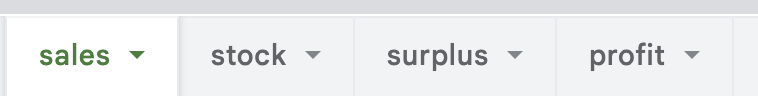
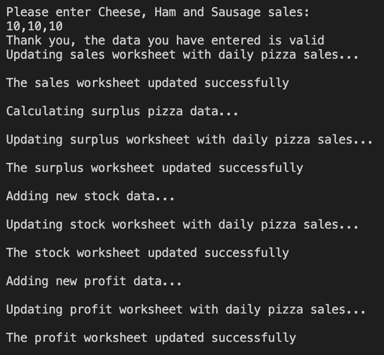
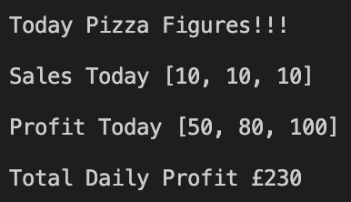
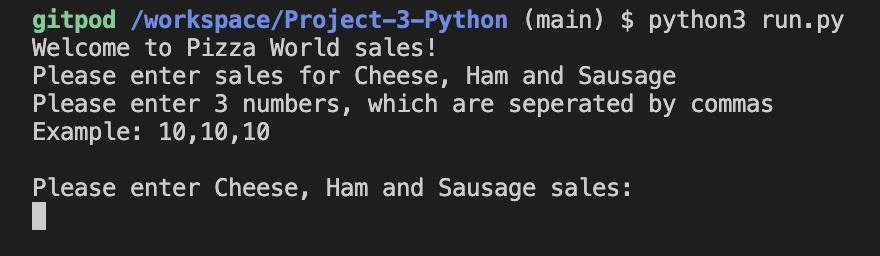
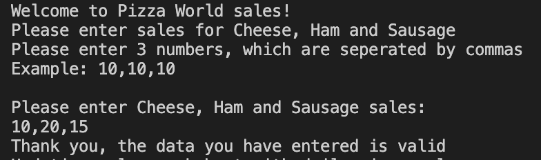
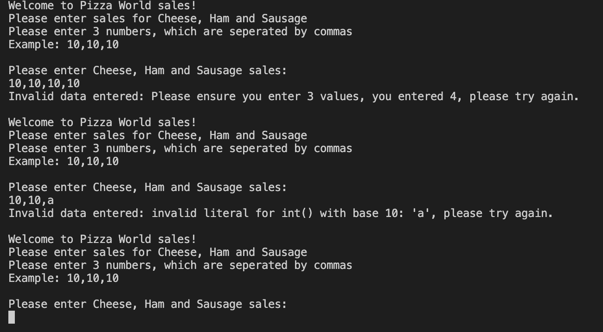
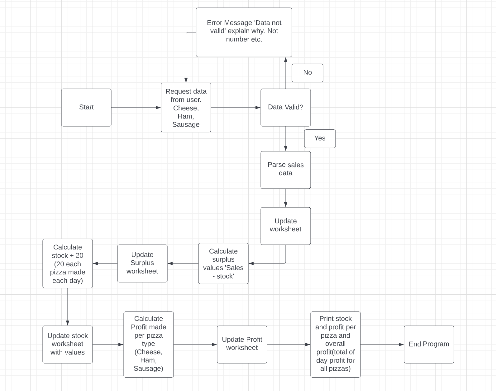
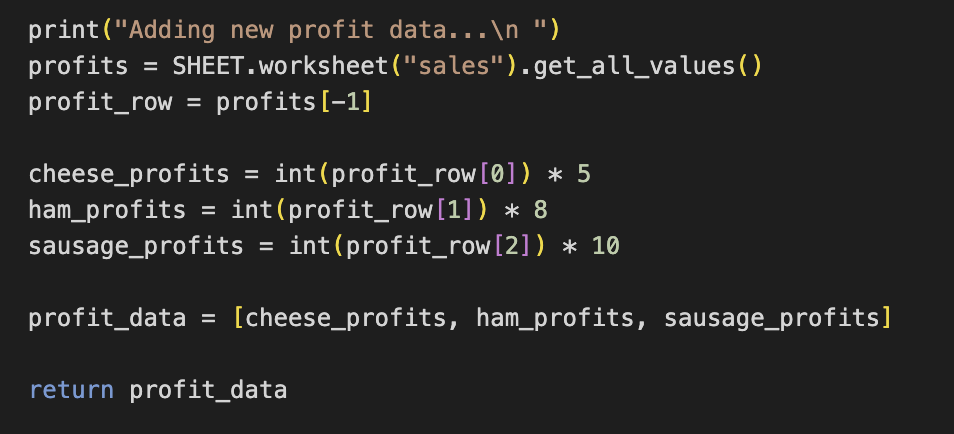

# Pizza World 

Pizza World is a Python terminal program which runs in the Code Institute mock terminal on Heroku. 

Pizza World is designed for a pizza company which sells 3 types of pizza:
- Cheese Pizza
- Ham Pizza 
- Sausage Pizza

Pizza World allows the user to:
- Input the daily sales of the pizza types
- Upload sales to a google worksheet
- Update the new stock levels for the next day
- Upload stock levels to a google worksheet
- Calculate the daily surplus pizzas
- Upload the surplus to a google worksheet
- Calculate the profit made on the pizza types each having a different profit margin
- Upload the profit of each type of pizza to a google worksheet
- Display to the user the total sales of each pizza for the day
- Display to the user the profit per pizza for the day
- Display the total profit made for the day from all pizza sales

[Here is the live version of the project](https://pizza-world.herokuapp.com/)

[Here is a live link to the google worksheet](https://docs.google.com/spreadsheets/d/1S1hgp-PmgAoM8KUjN3stYeTxWITjOD4pQTnUQbdar2Y/edit?usp=sharing)

 

## How it works

PizzaWorld allows the user to input the daily sales data of the 3 types of pizzas (Cheese, Ham and Sausage) sold during the day. 

The user inputs the total days sales data for the 3 types of Pizza, separated by commas starting (e.g. daily sales of Cheese 15, Ham 17, Sauage 19 is entered as 15,17,19) once inputted the user then presses "enter". 

This sends the sales data to a google worksheet and stores the sales figures for the business on the respective "sales" sheet. 

PizzaWorld uses the sales data to provide the user with key business information on the following areas: 

- Stock - The pizza business produces 20 of each pizza at the start of every day. This data is stored in the google worksheet on the "stock" sheet.
- Surplus - The sales data is subtracted from the stock and informs the pizza business how many pizzas were unsold that day or how many extra pizzas of a specific type they had to produce during the day. This data is stored in the google worksheet on the "surplus" sheet.
- Profit - Each pizza provides a different level of profit. This data is stored in the google worksheet on the "profit" sheet.
    - Cheese pizza provides £5.00 profit per pizza
    - Ham pizza provides £8.00 profit per pizza
    - Sausage pizza provides £10.00 profit per pizza

    Pizzaworld takes the sales data and calculates the profit for each type of pizza and stores this data in the "profit' sheet within the google worksheet. 

     

The user is informed via the terminal what processes PizzaWorld has completed and what areas of the google worksheet have been updated with new data. 

A user view example of the layout and wording is included below:

 
    
Once all these functions have been performed the user is provided with, via the terminal, a print out of the following: 

- Sales data for the day
- Profit per pizza for the day
- Total profit of all pizzas sold for the day

     

PizzaWorld provides the user with a tool that allows them to store sales data, calculate and record stock and surplus levels, provides and calculates profits for the types of pizza sold and provides the total profit made by the business. 

## Features
- Existing Features
    - Sales Data Entry
        - The user is welcomed and asked to enter sales data for the 3 types of pizza (Cheese, Ham, Sausage) 
        - The user is provided with clear instructions of how the sales data must be entered with an example visable on the terminal for the user. 
    
             

        - Accepts user data 
        - Informs user that the data entered is valid

             

        - Input validation and error-checking
            - You must enter numbers
            - You cannot enter blank spaces
            - You must enter 3 numbers

             

        - Loop in place to return user to data input to allow the user to enter valid data.

- Future Features
    - Allow user to adjust stock levels via the terminal
    - Allow user to adjust individual pizza pricing via the terminal
    - Add date to google worksheet and allow user to search via terminal for specific sales data entries for a specific day or date period
    - Add function that allows user to see the total profit for a week, month, year
    - Add function to allow user to add new pizzas (e.g name, profit) and update the google worksheet
 
## Data Model
- Flowchart plan
    - I decided to use a Flowchart plan to model and map the functionality of Pizzaworld. 
    - I was able to clearly see the path I wanted to follow when designing and creating Pizzaworld. 
    - This allowed me to ensure all areas of PizzaWorld were positioned correctly and had a blueprint to follow in order to produce a fully functioning program. 
    - I wanted to create a means of storing all the data inputted and created from PizzaWorld into a google worksheet to enable the user to use this data to aid with future business decisions i.e which pizzas are popular, whether more stock is needed for a particular pizza on a daily basis, which pizzas are providing the business with the most profit.

     

## Testing

I have manually tested this project by undertaking the following steps:

- Passed the code through a PEP8 linter and confirmed there are no problems
- Given invalid inputs: strings when numbers are expected, more than 3 numbers
- Tested in my local terminal and the Code Institute Heroku terminal

Manual testing example below:

 

## Bugs
 ### Solved Bugs

- I was receiving an error index because I had forgotten to add 'int' at the start of the various (profit_row). I fixed this by adding 'int' to all of the profit_row variables, which allowed the calculation to take place.
 

### Remaining Bugs

- No bugs remaining

## Validator Testing

- PEP8
    - No errors were returned from pep8ci.herokuapp.com

## Deployment

- The project was deployed using Code Institute's mock terminal for Heroku.

    - Steps for deployment
        - Create a new Heroku app
        - Add Config Vars for CREDS and PORT
        - Set the buildbacks to Pythong and NodeJS in that order
        - Link the Heroku app to the repository
        - Click on Deploy

## Credits

- Code Institute for the deployment terminal 
- Thanks to my mentor for his guidance and support during our mentor meetings