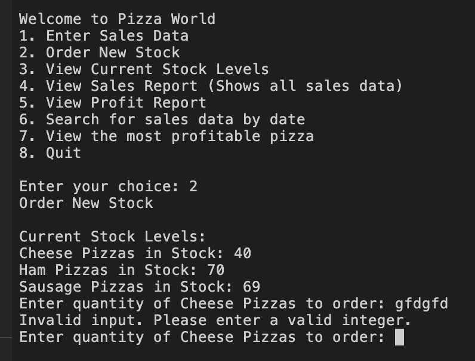

# Pizza World 

 

Pizza World is a Python terminal program which runs in the Code Institute mock terminal on Heroku. 

Pizza World is designed for a pizza company which currently sells 3 varieties of pizza:
- Cheese Pizza
- Ham Pizza 
- Sausage Pizza

Pizza World allows the user to perform various functions which are listed below: 

- Enter and store daily sales for the 3 types of pizza, 
- Order new stock of pizzas for the pizza company,
- View current stock levels of the 3 types of pizza,
- View a sales report which shows all the sales of pizza,
- Provide a search by date data sales function, 
- View a Profit Report which allows the user to view the profits from the sales data for each type of pizza and display the combined total profit for all pizza types, 
- View the most profitable pizza type.

[Here is the live version of the project](https://pizza-world.herokuapp.com/)

[Here is a live link to the google worksheet](https://docs.google.com/spreadsheets/d/1S1hgp-PmgAoM8KUjN3stYeTxWITjOD4pQTnUQbdar2Y/edit?usp=sharing)

## Data Model
- Flowchart plan
    - I decided to use a Flowchart plan to model and map the functionality of Pizza World. 
    - I was able to clearly see ad map the path I wanted to follow when designing and creating Pizza World. 
    - This allowed me to ensure all areas of Pizza World were positioned correctly and had a blueprint to follow in order to produce a fully functioning program. 
    - I wanted to create a means of storing all the data inputted and created from Pizza World into a google worksheet to enable the user to use this data to aid with future business decisions i.e which pizzas are popular, whether more stock is needed for a particular pizza on a daily basis, which pizzas are providing the business with the most profit.
    - It was vital that all data entered was checked for validation for being accepted into the worksheet and Pizza World. If any data was not valid, the user needed to be informed and offered the opportunity to enter valid data. 

    ### Flowchart Model

     

## How it works

### User Menu

 

Pizza World welcomes users to the User menu. This allows users to select one of 8 options depending on the function they would like to perform. The 8 options are listed below.

1. Enter Sales Data
 2. Order New Stock
 3. View Current Stock Levels
 4. View Sales Report (Shows all sales data)
 5. View Profit Report
 6. Search for sales data by date
 7. View the most profitable pizza
 8. Quit

The user has to enter the number of their choice. It must be a number between 1-8 otherwise it will fail validation checks and the user is returned to the user menu. 

 

#### 1. Enter Sales Data

This function allows the user to enter the sales data for the 3 pizza types, the user enters the date for the sales data to be assigned to. 

First the user has to enter the date for the sales data. 

 

Once the user has entered the date, the user inputs the sales data for each type of pizza. 

 

Once this data has been inputted correctly, the user is informed that all data has been entered successfully and the Sales worksheet has been updated with the data. 

In addition to this, the profit and loss worksheet has also been updated successfully, as this calculates the number of pizzas sold by their respective cost. This data, together with the total profit from the sale of all pizzas for that entry is saved on the profit worksheet. 

Finally the stock worksheet is updated. The number of pizzas that were inputted in the sales date for each pizza type is subtracted from the stock of that type of pizza and updates the stock number, to show the user how much stock is remaining of each pizza type. 

 

#### If stock levels are lower than 50 when sales data entered

After a user has inputted the sales data successfully, if stock levels for a pizza have dropped below 50, a message will display to inform the user that the current stock on that particular pizza type is low and they may want to consider ordering more stock. 

 

#### 2. Order New Stock

This function allows the user to order new stock for each pizza type. 

It displays to the user the following:

- Current stock levels - so the user can use this information to decide how much new stock they wish to order
- An input box to allow them to enter how much new stock for each pizza type they would like. This data must be entered correctly to meet validation requirements. 

 

Once this data has been inputted. The user is informed that the new stock has been ordered successfully and the stock worksheet has been updated. 

In addition to this, the updated stock levels are displayed to the user, they are able to view the new stock levels for each pizza type.

#### Updated Stock Image

 

#### 3. View Current Stock Levels

This function allows the user to view the current stock levels for all 3 pizza types. It displays the stock levels of all pizzas and returns the user to the user menu. 

#### 4. View Sales Report

This function allows the user to view a report of all the sales data that has been entered in the past. It displays the date, the type of pizza and how many were sold on the various input dates. 

#### 5. View Profit Report

This function allows the user to view the total profit for each pizza type itemised by the sales data dates. 

#### 6. Search for sales data by date

This function allows the user to search for a specific sales data entry by date. 

Once the user inputs the date, the user is shown the sales data entry. 

However, if there is no sales data for that given date, the user is informed that there is no sales data for that date. 

#### 7. View the most profitable pizza

This function allows the user to view which pizza is the most profitable. It allows the user to see clearly the profitibilty of the pizza which may aid them in making future business decisions. 

It itemises the profit for all pizza sales for each type of pizza and then below it displays which is the most profitable pizza. 

## Future Features

 - When a user inputs the sales data and stock levels drop below 50, an option for the user to order new stock to appear and perform the function, without having to access new order from the user menu. 

 - A login and logout function, where different levels of staff can access different levels of the user menu. 

 - A function to be able to edit/delete sales data

 - A function to be able to add new pizzas types

 - A function to be able to adjust the pizza cost. 

## Testing

I have manually tested this project by undertaking the following steps:

- Passed the code through a PEP8 linter and confirmed there are no problems
- Given invalid inputs: strings when numbers are expected, more than 3 numbers
- Tested in my local terminal and the Code Institute Heroku terminal

Manual testing example below:

### User Menu

The user can only enter numbers between 1-8 that will be accepted to access the functions. 

In addition to this, all number choices lead to the correct function as expected. 

### 1. Enter Sales Data

The user can only enter numbers in the correct format to be accepted by the function and set out as shown below. 

### 2. Order New Stock

The user can only enter numbers to order new stock. 

### 3. View Current stock levels

The user does not need to enter any additional data, other than the number 3 in menu choice in the user menu. This information is displayed as expected. 

### 4. View Sales Report

The user does not need to enter any additional data, other than the number 4 in menu choice in the user menu. This information is displayed as expected.

### 5. View Profit Report

The user does not need to enter any addiional data, other than the number 5 in menu choice in the user menu. This information is displayed as expected.

### 6. Search for sales data by date

The user has to input the date in the correct format to be accepted. 
 

Once this is entered, the function works as expected and will display sales data linked to that date if it exists, otherwise it will display a message saying that sales data is not found.

If there is no sales data for that given date, the user is informed that there is no sales data for that date. 

### 7. View the most profitable pizza

The user does not need to enter any additional data, other than number 7 in the menu choice in the user menu. This information is displayed as expected.

### 8. Quit

The user does not need to enter any additional data, other than number 8 in the menu choice in the user menu. The program is ended as expected. 

## Bugs

 ### Solved Bugs

 - I had an error when first entering stock levels for the first time. If the stock levels aren't on the spreadsheet as a number to begin with, any new stock number was trying to add to the written word headings of the respective columns ie trying to add an intejer to a string. I solved this by adding the first line of starting stock to the spreadsheet to the second row and this then worked with the project. 
 - I had a bug when I was adding new stock. All stock was being added to the cheese pizza type. I solved this by adding the following code

 

### Remaining Bugs

- The user can input the same date numerous times into the sales data. I would like to add a validation function to prevent the user from entering data into the sales figure, if a record of data is already held against that date. 

## Validator Testing

- PEP8
    - No errors were returned from pep8ci.herokuapp.com expect for 'line too long' errors

## Deployment

- The project was deployed using Code Institute's mock terminal for Heroku.

    - Steps for deployment
        - Create a new Heroku app
        - Add Config Vars for CREDS and PORT
        - Set the buildbacks to Pythong and NodeJS in that order
        - Link the Heroku app to the repository
        - Click on Deploy

## Credits

- Code Institute for the deployment terminal
- Code Institute Slack members for support
- Family and Friends for support throughout project.